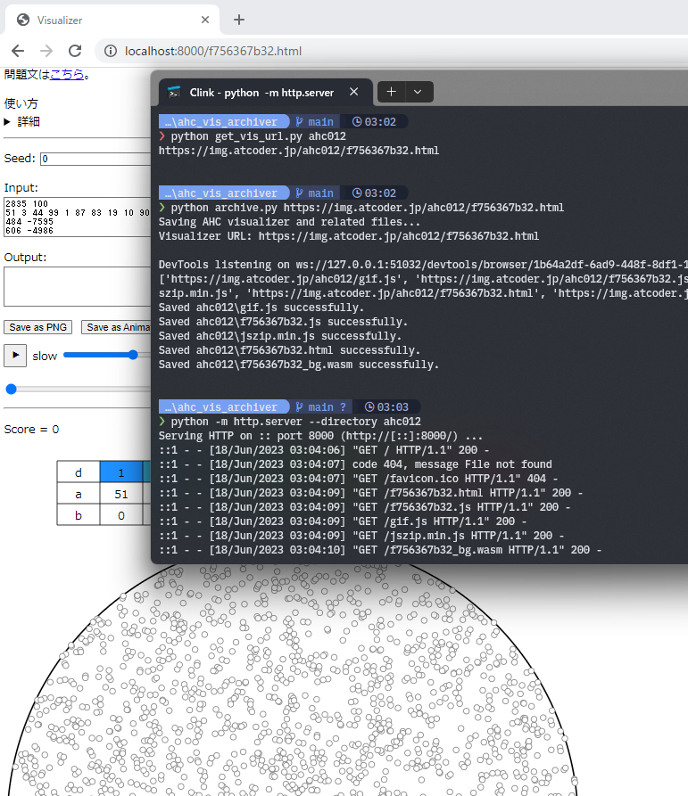
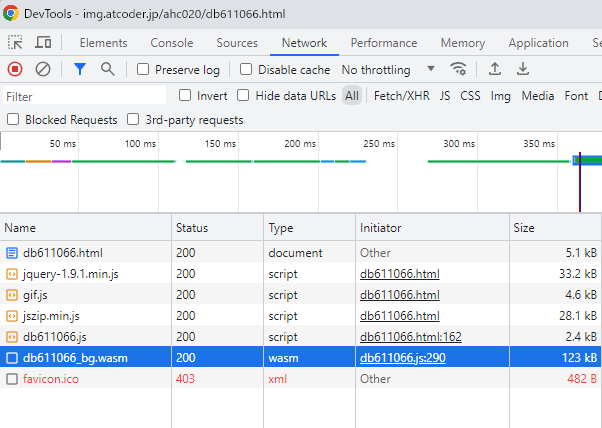

# AHC Vis Archiver <a href="#top" id="top">§</a>

This is a Python script to save the AtCoder AHC visualizer and related files to the local environment. Please make sure to have the Selenium chromedriver installed for this script to work properly.

<a href="#jp">Japanese Translation below. 日本語版はこちら</a>



## pre-requirement

* python3.10~ and related packages (see [pyproject.toml](pyproject.toml))
* chrome
* selenium chromedriver


## Usage

Run the script with the following command:

```bash
python archive.py <URL>
```

Replace `<URL>` with the actual URL of the AHC visualizer, for example:

```bash
python archive.py https://img.atcoder.jp/ahc020/db611066.html
```
The files will be saved in `./ahc020/*`.


There is also an auxiliary script available to extract the URL of the visualizer:

```bash
python get_vis_url.py <AHC_ID>
```

Replace `<AHC_ID>` with the corresponding AHC ID (e.g., "ahc020"). If successful, the URL of the visualizer's page will be returned. Pass this URL to archive.py for further processing.


To access the saved visualizer, you need to read the saved files from a file server on your localhost. You can do this by running a command like:


```bash
python -m http.server --directory ahc020 --port 8000
```

Then, you can access it from `localhost:8000`.


## How does it work?

The AHC visualizer is a web page using JavaScript and WebAssembly (wasm). Although you can save this page locally through browser functionality, this method does not save the required wasm files needed for proper functioning. Therefore, even if you open the saved page, it will not work correctly.

You can check the network logs in the browser's developer tools to see what files are being loaded.
  
For example, in the case of AHC020 shown above, it can be seen that six files are being loaded (excluding `favicon.ico`). However, when saving the `db611066.html` page, it does not include the necessary `db611066_bg.wasm` file, which is loaded by `db611066.js`. To ensure proper functionality, you need to manually save this missing `db611066_bg.wasm` file.

By saving the files in a directory and starting a file server with `python -m http.server`, you can access them from `localhost:8000`, for example.

This script automates the process of saving the files by using Selenium to capture the files loaded from the visualizer's page. It only captures files that match `img.atcoder.jp/ahc***`.


---

# AHC Vis Archiver <a href="#top" id="jp">§</a>

AtCoderのAHCのビジュアライザ関連のファイルをローカルに保存して実行できるようにするpythonスクリプトです. Selenium + Chrome を利用しているので selenium や google chrome, chromedriver などを事前にインストールしてください.

## 事前準備

* python3.10~ and related packages (see [pyproject.toml](pyproject.toml))
* chrome
* selenium chromedriver

python 関連のファイルは `rye` 環境があれば `rye sync` で揃います.

## 使い方

次のコマンドを実行してビジュアライザを保存できます.

```bash
python archive.py <URL>
```

\<URL\> の部分を保存したいビジュアライザのURLに置き換えてください. 例:

```bash
python archive.py https://img.atcoder.jp/ahc020/db611066.html
```
ファイルは `./ahc020/` に保存されます.

また, 補助としてAHCのIDからビジュアライザのURLを検出するスクリプトも用意しました.

```bash
python get_vis_url.py <AHC_ID>
```

`<AHC_ID>` を保存したい AHC に置き換えてください (`ach020` など).
検出に成功した場合, ビジュアライザの URL が標準出力に出力されます.
このURLを `archive.py` に渡してください.

保存したビジュアライザにアクセスするには, ローカルファイルにアクセスできるファイルサーバーを立てる必要があります. 例えば python なら次のようなコマンドです.

```bash
python -m http.server --directory ahc020 --port 8000
```

`localhost:8000` にアクセスするとビジュアライザが使えます.
適宜ディレクトリやポートを変更してください.

## どういう仕組み？

AHCのビジュアライザは基本的に javascript + wasm で動作するウェブページとして公開されています。
このページをブラウザの機能などからでローカルに保存できますが、
この方法では動作に必要な wasm ファイルなどを保存してくれないので
保存したページを開いても正常動作しません。

どんなファイルが読み込まれているかはブラウザの開発者ツールのネットワークのログを見ればわかります。  
  
例えば上の AHC020 では6個のファイルを読み込んでいることがわかります(`favicon.ico` は除外)。
このうち `db611066_bg.wasm` は `db611066.js` から読み込むようになっているため
`db611066.html` のページを保存しようとしても拾ってくれません。  
よってこの不足している `db611066_bg.wasm` を追加で保存してやれば正常動作するようになります。  

例えば一連のファイルを保存したディレクトリで `python -m http.server` などのファイルサーバーを起動すると
`localhost:8000` などからアクセスできるようになります。

このように手動で保存することも可能ですが、このスクリプトは Selenium を使ってビジュアライザのページから読み込まれた
ファイルを拾って保存します。 `img.atcoder.jp/ahc***/` が一致するもののみを拾います。
